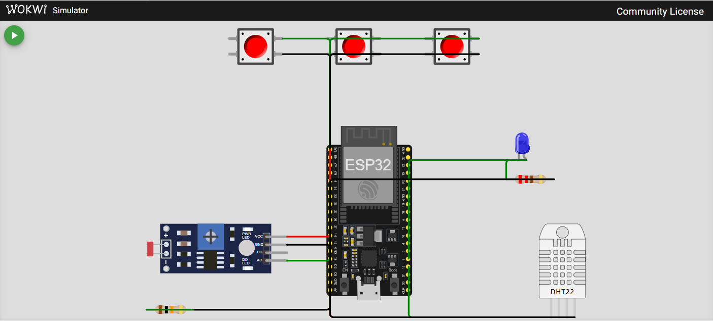

# 🌱 Sistema de Irrigação Inteligente com ESP32

## 📌 Descrição do Projeto

Este projeto simula um sistema de irrigação inteligente utilizando o microcontrolador ESP32.  
O desenvolvimento foi realizado no **Visual Studio Code com PlatformIO** e o circuito foi simulado utilizando a plataforma **Wokwi**.

O objetivo é automatizar o acionamento da irrigação com base em condições do solo, como umidade, pH e níveis de nutrientes.

---

## ⚙️ Componentes Utilizados

- ESP32
- 3 botões (simulando NPK)
- Sensor DHT22 (umidade)
- Sensor LDR (simulação de pH)
- LED (bomba de irrigação)
- Resistores

---

## 🧠 Lógica do Sistema

O sistema realiza a leitura dos sensores e toma a decisão de ligar ou não a irrigação.

A irrigação (LED) será ativada quando:

- Os três nutrientes estiverem adequados:
  - Nitrogênio (N)
  - Fósforo (P)
  - Potássio (K)
- A umidade do solo estiver abaixo de 40%
- O pH (simulado pelo LDR) estiver dentro de uma faixa aceitável

Caso qualquer uma dessas condições não seja atendida, a irrigação permanece desligada.

---

## 🎮 Funcionamento

### 🔘 Botões (NPK)
- Primeiro botão → Nitrogênio (N)
- Segundo botão → Fósforo (P)
- Terceiro botão → Potássio (K)

Quando pressionados, indicam que o nutriente está em nível adequado.

---

### 💧 Sensor de Umidade (DHT22)
Simula a umidade do solo:
- Valores baixos (< 40%) → solo seco → irrigação necessária
- Valores altos → irrigação desnecessária

---

### ☀️ Sensor LDR (pH)
Simula o pH do solo:
- Valores adequados → irrigação pode ocorrer
- Valores fora da faixa → irrigação não ocorre

---

### 💡 LED (Bomba de Irrigação)
- Aceso → irrigação ativada
- Apagado → irrigação desativada

---
## 🖼️ Circuito no Wokwi

---

## 🎥 Vídeo Demonstrativo

O funcionamento completo do sistema pode ser visualizado no vídeo abaixo:

https://www.youtube.com/watch?v=erIzgrY8Xik

---

## 🚀 Tecnologias Utilizadas

- C++
- ESP32
- PlatformIO
- Wokwi

---

## 📊 Conclusão

O projeto demonstra como sensores e lógica embarcada podem ser utilizados para automatizar processos agrícolas, permitindo decisões inteligentes e contribuindo para o uso eficiente de recursos hídricos.

---
